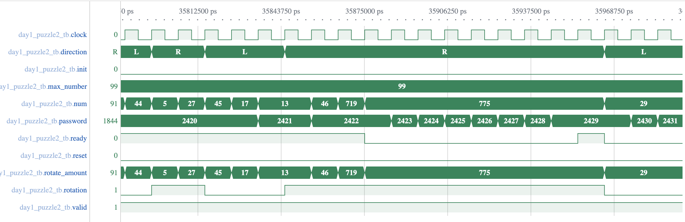

# Day 1

The design for Day 1 (both parts) is based on a FSM with 2 main states: **_ROTATE_** and **_REDUCE_**.

The puzzle mentions 99 as the highest number on the dial (which we will further call **max_number**). As I wanted my design to scale for different sizes, and be able to solve arbitrary inputs, the FSM can accept the maximum number on the dial as an input and use it to compute the number of times we see zero as mentioned in the puzzle.

Because of this, we cannot know beforehand the amount/number we need to reduce by, as basically all this is, is just a modulo operation with the highest number on the dial. If we only used 99, we could have optimized the modulo operation for it.

Nevertheless, the idea here is the following:
- We receive an input for our rotation as the direction and the number turns
- If the number is higher than our **max_number** we first got to the **_REDUCE_** state, otherwie we directly perform our **_ROTATE_** state
- In the **_REDUCE_** state we decrement our input by **max_number** until it fits the [0, max_number] range. After this we go to the **_ROTATE_** state
- In the **_ROTATE_** state we perform the turning by adding or subtracting the [reduced] input. Additionally we perform in the same state (and same cycle) a final correction as the result my overflow or underflow.

Being a FSM, we have some control and status signals such as:
- init: control signal for saving the highest dial number internally in a register
- ready: status signal by FSM that is ready to receive a new input
- valid: control signal to let the FSM know that the current input can be processed

The password (number of zeroes seen) is kept in a register that is incremented whenever a click is seen. The rotate direction and rotate amount are also registered, as if we need to do a reduction which can take multiple cycles, we need to keep those values as the input might change in the mean time.

The main module called **day1_puzzle** is parameterized to implement both parts of the puzzle. Based on the puzzle part we increase our password register wither when we have zero as a result of a rotation (part 1) or when we detected an overflow on our reduced input or on the initial rotated result (before the final correction).

A snapshot of the simulaton:


Here we can see how, when we encounter a large number like 719, the FSM becomes busy (ready signal is zero) and it spends 9 cycles: 
 - 7 for correction of the input as 719/99=7
 - one for transition from **_REDUCE_** to **_ROTATE_**
 - one for the rotation calculation,
 
 until it can process a new input. Otherwise for small inputs that don't overflow/underflow the rotation, it can process a new input each clock cycle.

## Input/Output ports

```verilog
input logic clock,
input logic reset,
input logic init, //save the max_number
input logic valid, //we have a valid input that can be used
input logic rotation, //1-right,0-left
input logic [WIDTH-1:0] rotate_amount,
input logic [WIDTH-1:0] max_number, //highest number on the dial
output logic ready, ///ready to receive a (new) input
output logic [WIDTH-1:0] password
```

## Parameters

```verilog
parameter WIDTH=16, //width of our inputs in bits
parameter PUZZLE = 1 //part 1 or part 2 of the puzzle
```

## FPGA Resource Consumption

We consider 16-bit inputs.

### Part 1

| LUT as Logic | LUT as Memory | Register as Flip Flop | Register as Latch | BRAMs | DSPs | CARRY |
| :----------: |:-------------:| :--------------------:|:-----------------:|:-----:|:----:|:-----:|
| 120          | 0             | 66                    |0                  |0      |0     |28     |

**LATENCY FOR DAY 1 PUZZLE INPUT= 9030 Clock Cycles**

### Part 2

| LUT as Logic | LUT as Memory | Register as Flip Flop | Register as Latch | BRAMs | DSPs | CARRY |
| :----------: |:-------------:| :--------------------:|:-----------------:|:-----:|:----:|:-----:|
| 122          | 0             | 66                    |0                  |0      |0     |28     |

**LATENCY FOR DAY 1 PUZZLE INPUT= 9030 Clock Cycles**

[Back to main page](../README.md)