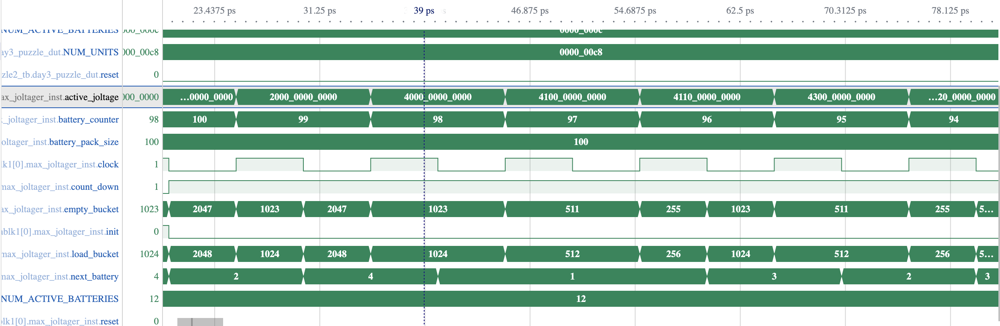
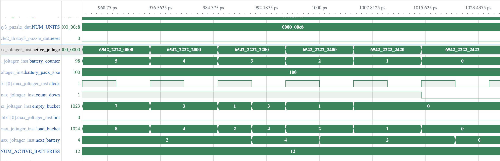

# Day 3

The design for Day 3 (both parts) is implemented in pipeline, at the level of the batteries per battery pack. This means that given a battery pack of 12 batteries, we can process in pipeline a new battery in this battery pach each clock cycle.

The design of the top module in its lightest form can handle a battery pack, and each battery pack should be send in sequence, in which case an accumulator should be added at the end of the pipeline to add up all the largest joltages detected.

As I also cared about performance and wanted to speed up the simulation time, I decided to parallelize this module for each aailable battery pack, meaning that for our puzzle input with 200 different battery packs, we have 200 parallel units that can get detect their largest joltage in their battery pack, and afterwards send it to a pipelined adder tree that will compute all sums making use of 3:2 adder compressors to minimize the number of level of the adder tree.

Thus, what both designs for part 1 and part have in common are the last two stages of the pipeline, which are:
- BCD to binay converter
- Adder tree, which is itself further pipelined on each level; the total number of levels is equal to log3(number_of_units)

The reason we have a BCD to binary converter is the following: as we are detecting the largest sequence of 4-bit numbers and "concatanating" them together, we will get the largest joltage in the BCD form. Thus, in order to get the final sum we need to convert these numbers to binary in order to use the binary adder tree.

For the first part we are using a small BCD to binary converter for 2 digits (8 bits in total). The second part is using a parameterized bcd to binary converter based on the [double dabble algorithm](https://en.wikipedia.org/wiki/Double_dabble) which is friendly for hardware, although it will affect the timing for large numbers. It can be split in different pipeline stages as well if needed, but I didn't do it for the purpose of the puzzles.

As mentioned, for the light version with a single unit where each battery pack needs to be send in sequence, we should replace the adder tree with an accumulator.

### Part 1 design

Now for the actual detection of the largest joltage in a given baterry pack, we will start with part 1, where we need to detect the hight joltage made out of tho digits, 8-bits in total. An image preview can be seen below:


Basically each unit keeps a 8-bit register with the current highest joltage detected. On a new input it concatenates the highest 4-bit part and lowest 4-bit part of this register with the new 4-bit input, setting this input as the least significant part. Afterwards it compares all three values and updates the register with the highest one.

Each unit in the high-performance parallel version sends it highest joltages to a BCD to Binary converter. The output of this module is then feeded to an pipelined adder tree which is made out of 3:2 Adder Compressors. As we have a high number of units, and thus inputs to the adder, the adder tree made of 3:2 Compressors give a better performance/area trade-off in FPGAs. The inspiration for the adder tree can be seend [here](https://community.element14.com/technologies/fpga-group/b/blog/posts/the-art-of-fpga-design---post-16).

### Part 2 design

For the design of the second part I went for a similar approach.
Now we have a set of 4-bit registers equal to the number of active batteries we have to find (12 in our case, but the module is parameterized so it can be used for other values as well).

Each register has a load and reset control signal.

On a new 4-bit input representing a battery, we compare it with all 12 registers and use a priority encoder to decide which register can be updated with the new value and which registers should be reset. Basically in our range of **[11:0]** registers, starting from register 11, if register **i** is lower than our new input, then we load the new value in that register and reset all the remaining **[i-1:0]** registers.

Of course we have finite number of batteries in a battery pack, so we cannot always reset the least significant registers at every input, as if we receive our last input and see that it can be loaded in register 11 for example, all remaining registers will be reseted resulting in a wrong values.

What I did for part two is to also accept as input the total number of batteries in the pack and store it in a counter. Which each new input we decrement the counter. With each new input , when we compare it with all registers, we make sure to update a certain register **i** and reset all remaining registers only if that register index is smaller then our current counter value (indexes being zero-based). 

Thus, as example, if we know we have only 6 inputs left to receive, we know we can only update them in the least significant 6 registers from our total of 12 registers. This way we also make sure to respect the constraint that the largest joltage should be made in the exact order of the batteries.

Simulation snapshots for a single unit at the beggining and end can be seen below:



## Input/Output ports

### Part 1

```verilog
input logic clock, reset, en,
input logic[3:0] next_battery [NUM_UNITS],
output logic [NUM_UNITS - 1 + 7:0] joltage_sum
```

### Part 2

```verilog
input logic clock, reset, init,
input logic[3:0] next_battery [NUM_UNITS],
input logic[7:0] battery_pack_size [NUM_UNITS],
output logic [BIN_W+NUM_UNITS-2:0] joltage_sum
```

## Parameters

### Part 1
```verilog
parameter NUM_UNITS = 200, //equal to number of battery packs
```
### Part 2
```verilog
parameter NUM_UNITS = 200, //equal to number of battery packs
parameter NUM_ACTIVE_BATTERIES=12, //how many active batteries we should detect in a battery pack
localparam BCD_W = 4*NUM_ACTIVE_BATTERIES, //size in bits of the joltage BCD number 
localparam BIN_W = BCD_W*3/4+4 //size in bits of the joltage binary number
```

## FPGA Resource Consumption

### Part 1 - Full design (200 parallel units)

| LUT as Logic | LUT as Memory | Register as Flip Flop | Register as Latch | BRAMs | DSPs | CARRY |
| :----------: |:-------------:| :--------------------:|:-----------------:|:-----:|:----:|:-----:|
| 5474          | 0             | 5118                    |0                  |0      |0     |1211     |

**LATENCY FOR DAY 3 PUZZLE INPUT = 106 Clock Cycles**

### Part 2 - Full design (200 parallel units)

| LUT as Logic | LUT as Memory | Register as Flip Flop | Register as Latch | BRAMs | DSPs | CARRY |
| :----------: |:-------------:| :--------------------:|:-----------------:|:-----:|:----:|:-----:|
| 172155          | 0             | 23582                    |0                  |0      |0     |1124     |

**LATENCY FOR DAY 3 PUZZLE INPUT= 106 Clock Cycles**

[Back to main page](../README.md)