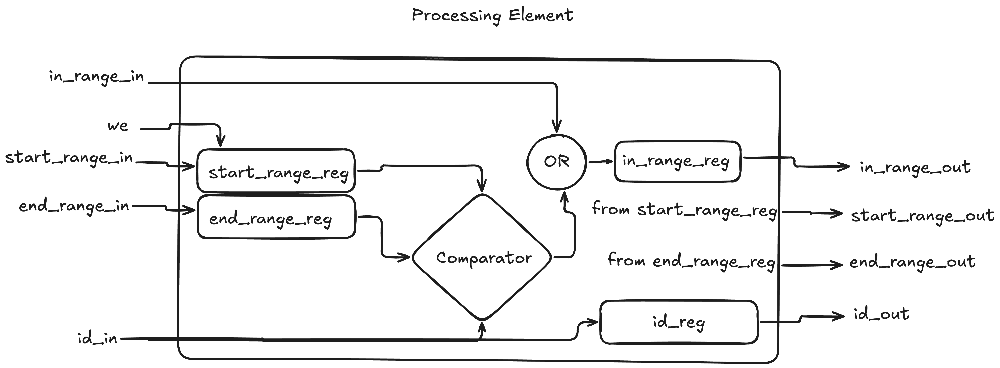

# Day 5

### Part 1 design

The design for Day 1 Part 1 is implemented as a chain of processing elements(PEs) where each processing element will hold a range.

In order to keep the total execution time in termns of our inputs: number of ranges (**n**) and number of ids (**m**), I went for a solution that outputs the result in time complexity **O(n+m)**. The main desing is made out of a chain of elements, where each element can hold a range. The design is parameterized so that the width of our inputs(ranges and ids) and the number of processing elements in the chain can be modified as needed. 

We first load all available ranges in the processing elements, by sending each range (start and end) every clock cycle. Once the ranges are loaded, we can start the processing of the IDs send at each clock cycle a new ID. At the end of the processing chain there is a counter that collects the results and adds them up one by one for each passing ID as long as the ID is marked as valid for being counted.

Thus, the actual execution time is around **2n+m+1** cycles:
- **n** cycles to load all ranges
- **m** cycles to send all IDs
- **n** cycles until last ID passes by the chain of **n** elements
- **1** more cycle for the counter to add up the last ID

Below there is an overview of a processing element:


Each processign element will register its new input (for both ranges and IDs) and it will output it further to the next element so that first: all ranges will be propagated through the chain such that first range will be stored in the last element of the chain and the last range will be stored in the first element of the chain.

Similar for the IDs, every ID it will be propagated through each element, so that we compare it against the stored range and decide if it is in the range or not. If it is part of that range we mark the **in_range** flag for that ID and propagate it along the ID. If that ID is marked as part of a range already then any future processing element will just propagate it further as well, regardless if any future range includes that ID.

At the end of the chain, this **in_range** flag of every ID encountered is used as the **count_up** control signal of our counter for counting all fresh IDs.

The design for part 1 can accept an arbitrary number of IDs, and needs to be re-synthesized for supporting more ranges.

### Part 2 design

Second part of the design is implemented similar to a FSM-style, but to make it more interesting I didn't explcitly describes the FSM controller logic, and decided to use the control and status signals of the submodules in order to complete the task of loading the ranges and processing the IDs.

The deisgn for part 2 is amde of a two BRAMs acting as memories to hold the range start and end values. As Artix-7 series have BRAMs that can be configured to support 512 64-bit values, I went for that, so basically we can support more ranges at no extra area cost, and we can even extend the amount of ranges supported.

Like in the case of part 1, we have to load all ranges first, one by one at every clock cycle. With each range loaded we also keep track through a counter of the latest address (our highest address) that we used to store the latest range.

Once all ranges we begin what I called a transfer process. Starting from latest address which we will call **last_address**, we read the range at that address (which at the begining is our latest range saved), and then compare it, at every clock cycle with all the remaining ranges sitting at addresses **last_address-1..0** (also by using a different counter which we will call **max_address**). If we see that the two ranges, the one from **last_address** and the one from the current memory location we've read are interleaved, then we expand the two ranges into a single one and save it at the current memory location. 

Once **max_address*** reached 0, we decrement **last_address** validated, and start counting down again from **last_address-1** to zero, by loading the **last_address-1** into the **max_address** counter. We reapeat this entire process until **last_address** also reaches zero at wich point there is nothing more to process.

Basically at the end of this hardware "nested for loop", we would have commpared all ranges between them, deciding what ranges interleave in any possible combination. To know what locations in our memory hold the expanded valid ranges, we also geep track of it by using a long flag register called **valid_addresses**, where each bit corresponds to a memory location. Whenever we see that the range from the current **last_address** and the range from the current **max_address** interleave, we mark the bit correspoinding to the **last_address** index as invalid (zero). At reset/start, the register is initialized with full 1s, so that all ranges are marked as possible valid.

Once this process finished, we start the last stage, where we iterate again through the entire memory, and output the valid ranges one by one to an accumulator that will add the difference between the end and start values of the range to get the total number of fresh ingridients at each range.

Of course the performance is not the best as we have **O(n\*n)** time complexity, but the footprint of the area is very small, and can be easily extended for longer ranges (even the current design can hold 512 64-bit ranges with no extra overhead). In reality the total number of clock cycle will be around **n\*(n-1)/2 + 2n + 1**:
- **n** cycles to load the ranges
- **n\*(n-1)/2** cycles to process all ranges
- **n** more cycles to output all ranges that are valid
- **1** more cycle for the last range to be added to our accumulator


## Input/Output ports

### Part 1

```verilog
input logic clock, reset,
input logic load_ranges,
input logic [WIDTH-1:0] start_range, end_range,
input logic [WIDTH-1:0] id,
output logic [31:0] total_fresh
```

### Part 2

```verilog
input logic clock, reset,
input logic load_ranges,
input logic start_transfer,
input logic [WIDTH-1:0] start_range, end_range,
output logic [WIDTH-1:0] total_fresh,
output logic stop
```

## Parameters

### Part 1
```verilog
parameter WIDTH=64, //size in bits of the supported ranges and ids
parameter DEPTH=183 //depth of out processing elements chain (basically how many ranges we can process)
```

### Part 2
```verilog
parameter WIDTH=64, //size in bits of the supported ranges and ids
parameter DEPTH=512 //depth of out range memory (basically how many ranges we can process)
```

## FPGA Resource Consumption

### Part 1

Parameters set as WIDTH = 64 (bits) and DEPTH = 183 (processing elements).

| LUT as Logic | LUT as Memory | Register as Flip Flop | Register as Latch | BRAMs | DSPs | CARRY |
| :----------: |:-------------:| :--------------------:|:-----------------:|:-----:|:----:|:-----:|
| 11897          | 0             | 35287                    |0                  |0      |0     |2936     |

**LATENCY FOR DAY 5 PUZZLE INPUT = 1367 Clock Cycles**

### Part 2

Parameters set as WIDTH = 64 (bits) and DEPTH = 512.

| LUT as Logic | LUT as Memory | Register as Flip Flop | Register as Latch | BRAMs | DSPs | CARRY |
| :----------: |:-------------:| :--------------------:|:-----------------:|:-----:|:----:|:-----:|
| 1259          | 0             | 732                    |0                  |2      |0     |81     |

**LATENCY FOR DAY 5 PUZZLE INPUT= 17201 Clock Cycles**

[Back to main page](../README.md)